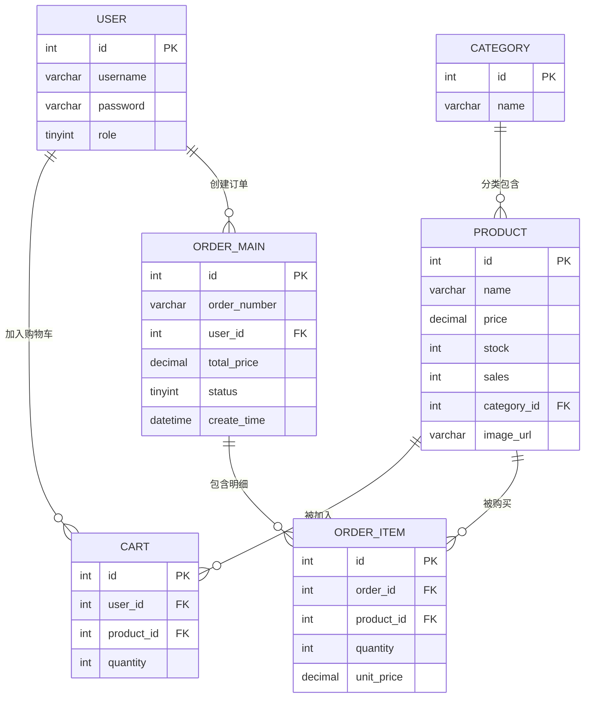
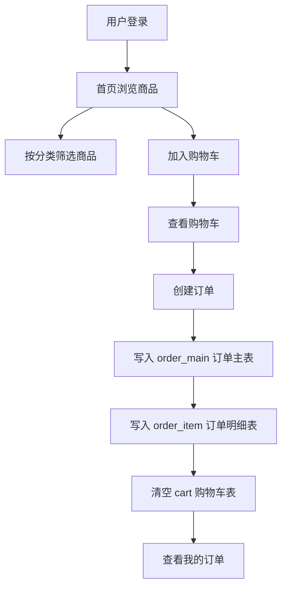
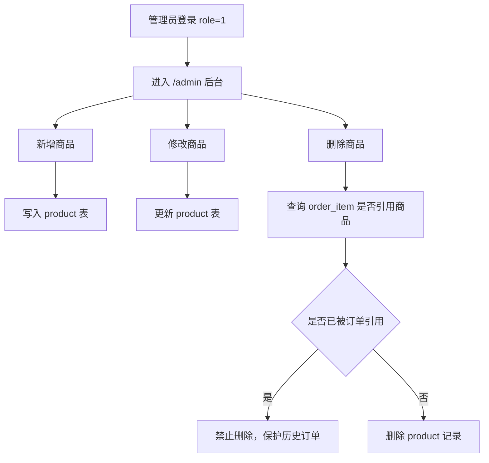

# Book_Mysql 数据库课设答辩说明

## 一、项目定位

`Book_Mysql` 是一个基于 Spring Boot、Thymeleaf、MyBatis、MySQL 的图书/商品商城系统。系统围绕“用户登录注册、商品浏览、购物车、下单、订单管理、管理员商品维护”展开。

项目重点和数据库直接相关的部分包括：

- `application.properties`：配置 MySQL 连接、MyBatis XML 路径、实体类别名。
- `entity`：Java 实体类，对应数据库表或联表查询结果。
- `mapper` 接口：定义数据库操作方法。
- `resources/mapper/*.xml`：真正编写 SQL 的位置。
- `service`：调用 Mapper，完成业务逻辑，例如注册查重、购物车合并、订单事务创建。
- `book.sql`：数据库建表脚本和初始数据。

## 二、项目结构图

```text
数据库-spring
├── book.sql                         # MySQL 建表与测试数据
└── Book_Mysql
    ├── pom.xml                      # Maven 依赖：Spring Boot、Thymeleaf、MyBatis、MySQL 驱动
    ├── uploads/books                # 管理员上传的商品图片
    └── src/main
        ├── java/com/book
        │   ├── BookMysqlApplication.java   # 项目启动类，扫描 Mapper
        │   ├── config
        │   │   ├── LoginInterceptor.java   # 登录拦截器
        │   │   └── WebConfig.java          # MVC 配置：拦截规则、上传图片访问路径
        │   ├── controller
        │   │   ├── AuthController.java     # 登录、注册、退出
        │   │   ├── ProductController.java  # 首页商品浏览、分类筛选、个人信息
        │   │   ├── CartController.java     # 购物车查看、加入、删除
        │   │   ├── OrderController.java    # 创建订单、查看订单、确认/取消订单
        │   │   └── AdminController.java    # 管理员商品新增、修改、删除、图片上传
        │   ├── entity                      # 实体类，对应数据库表或查询结果
        │   ├── mapper                      # MyBatis Mapper 接口
        │   └── service                     # 业务逻辑层
        └── resources
            ├── application.properties      # 数据库、MyBatis、上传配置
            ├── mapper/*.xml                # SQL 映射文件
            ├── static                      # CSS、JS、静态图片
            └── templates                   # Thymeleaf 页面模板
```

## 三、数据库结构与关系



### 表设计说明

| 表名 | 作用 | 关键字段 |
|---|---|---|
| `user` | 存储用户账号 | `role` 区分普通用户和管理员，`username` 唯一 |
| `category` | 商品分类 | 与 `product.category_id` 形成一对多 |
| `product` | 商品/图书信息 | 价格、库存、销量、图片、所属分类 |
| `cart` | 购物车 | `user_id + product_id` 设置唯一索引，避免同一用户重复插入同一商品 |
| `order_main` | 订单主表 | 保存订单号、用户、总价、状态、创建时间 |
| `order_item` | 订单明细表 | 保存订单中的每个商品、数量和下单时单价 |

外键设计体现了数据库完整性：

- 删除用户时，购物车和订单会级联删除。
- 删除商品时，购物车项和订单明细会受外键约束影响；代码中还通过 `countOrderReferences` 防止删除已经出现在订单中的商品。
- 删除订单主表时，订单明细通过 `ON DELETE CASCADE` 一起删除。

## 四、核心代码注释与答辩讲解

### 1. 数据库连接配置：`application.properties`

```properties
spring.datasource.driver-class-name=com.mysql.cj.jdbc.Driver
spring.datasource.url=jdbc:mysql://localhost:3306/book?useSSL=false&serverTimezone=Asia/Shanghai&allowPublicKeyRetrieval=true&characterEncoding=utf8
spring.datasource.username=root
spring.datasource.password=...

mybatis.mapper-locations=classpath:mapper/*.xml
mybatis.type-aliases-package=com.book.entity
mybatis.configuration.map-underscore-to-camel-case=true
```

答辩讲法：

- `spring.datasource.*` 负责连接本地 MySQL 的 `book` 数据库。
- `mybatis.mapper-locations` 指定 SQL XML 文件位置。
- `type-aliases-package` 让 XML 中可以直接写 `Product`、`User` 这类实体名。
- `map-underscore-to-camel-case=true` 让数据库字段 `user_id` 自动映射到 Java 属性 `userId`。

### 2. 启动类：`BookMysqlApplication`

```java
@MapperScan("com.book.mapper")       // 自动扫描 Mapper 接口，交给 MyBatis 创建代理对象
@SpringBootApplication               // Spring Boot 项目启动入口
public class BookMysqlApplication {
    public static void main(String[] args) {
        SpringApplication.run(BookMysqlApplication.class, args);
    }
}
```

答辩重点：项目启动后，Spring Boot 加载 Controller、Service、Mapper 等 Bean；MyBatis 根据 Mapper 接口和 XML SQL 文件完成数据库访问。

### 3. 实体类：`entity`

主要实体和数据库表的对应关系：

| Java 类 | 对应内容 |
|---|---|
| `User` | `user` 表 |
| `Category` | `category` 表 |
| `Product` | `product` 表 |
| `Cart` | `cart` 表 |
| `OrderMain` | `order_main` 表 |
| `OrderItem` | `order_item` 表 |
| `CartItem` | 购物车联表查询结果，不是单独表 |

`CartItem` 比较适合答辩重点讲：

```java
public BigDecimal getItemTotal() {
    if (price == null || quantity == null) {
        return BigDecimal.ZERO;
    }
    return price.multiply(BigDecimal.valueOf(quantity));
}
```

说明：

- `CartItem` 来自 `cart` 和 `product` 的联表查询。
- `getItemTotal()` 根据商品单价和购买数量计算小计。
- 金额使用 `BigDecimal`，比 `double` 更适合处理价格，避免浮点误差。

### 4. Mapper 接口与 XML SQL

MyBatis 的工作方式是：Controller 调 Service，Service 调 Mapper 接口，Mapper 接口对应 XML 中的 SQL。

#### 用户登录和注册：`UserMapper.xml`

```xml
<select id="login" resultType="User">
    select id, username, password, role
    from user
    where username = #{username} and password = #{password}
</select>
```

注释：

- `id="login"` 对应 `UserMapper.login()` 方法。
- `#{username}` 和 `#{password}` 是预编译参数，占位绑定可以减少 SQL 注入风险。
- 查询成功返回 `User`，失败返回 `null`。

```xml
<insert id="insert" parameterType="User" useGeneratedKeys="true" keyProperty="id">
    insert into user(username, password, role)
    values (#{username}, #{password}, #{role})
</insert>
```

注释：

- 用于注册新用户。
- `useGeneratedKeys=true` 表示插入后获取数据库自增主键。
- `keyProperty="id"` 把自增 id 回填到 Java 对象的 `id` 属性。

#### 商品查询和管理：`ProductMapper.xml`

```xml
<select id="findByCategoryId" resultType="Product">
    select id, name, price, stock, sales, category_id, image_url
    from product
    where category_id = #{categoryId}
    order by id
</select>
```

注释：

- 按分类查询商品，用于首页分类筛选。
- `category_id` 自动映射到 `Product.categoryId`。

```xml
<select id="countOrderReferences" resultType="int">
    select count(*)
    from order_item
    where product_id = #{id}
</select>
```

注释：

- 删除商品前先查询该商品是否已经出现在订单明细中。
- 如果已经有订单引用，就不直接删除，避免破坏历史订单数据。

#### 购物车：`CartMapper.xml`

```xml
<select id="findItemsByUserId" resultType="CartItem">
    select c.id as cart_id,
           c.product_id,
           c.quantity,
           p.name,
           p.price,
           p.image_url
    from cart c
    join product p on c.product_id = p.id
    where c.user_id = #{userId}
    order by c.id
</select>
```

注释：

- 这是典型联表查询，`cart` 表存数量，`product` 表存商品名称、价格、图片。
- 查询结果封装为 `CartItem`，方便页面直接显示购物车商品信息。

```xml
<select id="findByUserAndProduct" resultType="Cart">
    select id, user_id, product_id, quantity
    from cart
    where user_id = #{userId} and product_id = #{productId}
</select>
```

注释：

- 添加购物车前先查是否已有同一商品。
- 如果没有就插入一条新记录；如果已有，就更新数量。
- 数据库中也设置了 `user_id + product_id` 唯一索引，双重保证不会重复。

#### 订单：`OrderMapper.xml`

```xml
<insert id="insertOrder" parameterType="OrderMain" useGeneratedKeys="true" keyProperty="id">
    insert into order_main(order_number, user_id, total_price, status)
    values (#{orderNumber}, #{userId}, #{totalPrice}, #{status})
</insert>
```

注释：

- 创建订单主表记录。
- 插入后得到订单 `id`，再用于插入 `order_item` 明细。

```xml
<select id="findItemsByOrderId" resultType="OrderItem">
    select oi.id,
           oi.order_id,
           oi.product_id,
           oi.quantity,
           oi.unit_price,
           p.name as product_name,
           p.image_url
    from order_item oi
    left join product p on oi.product_id = p.id
    where oi.order_id = #{orderId}
    order by oi.id
</select>
```

注释：

- 查询订单明细时联表商品表，获得商品名称和图片。
- 使用 `left join`，即使商品记录异常缺失，也尽量保留订单明细展示。

### 5. Service 业务逻辑

#### `UserService`

```java
public User login(String username, String password) {
    if (!StringUtils.hasText(username) || !StringUtils.hasText(password)) {
        return null;
    }
    return userMapper.login(username.trim(), password);
}
```

说明：

- 先做非空校验。
- 去掉用户名首尾空格。
- 调用数据库查询完成登录验证。

```java
public String register(String username, String password) {
    if (userMapper.findByUsername(cleanUsername) != null) {
        return "用户名已存在";
    }
    User user = new User();
    user.setRole(0);
    userMapper.insert(user);
    return null;
}
```

说明：

- 注册前查重。
- 普通注册用户默认 `role=0`。
- 管理员在数据库初始数据中设置 `role=1`。

#### `CartService`

```java
public void add(Integer userId, Integer productId) {
    Cart existing = cartMapper.findByUserAndProduct(userId, productId);
    if (existing == null) {
        // 第一次加入购物车：插入新记录
        cartMapper.insert(cart);
    } else {
        // 已经加入过：数量 +1
        cartMapper.updateQuantity(existing.getId(), existing.getQuantity() + 1);
    }
}
```

说明：

- 这是购物车的核心逻辑。
- 同一个用户同一个商品不会插入多条购物车记录，而是增加数量。
- 对应数据库唯一索引 `user_product_unique(user_id, product_id)`。

#### `OrderService`

```java
@Transactional
public String create(Integer userId) {
    List<CartItem> cartItems = cartMapper.findItemsByUserId(userId);
    if (cartItems.isEmpty()) {
        return "购物车为空，无法下单";
    }

    // 计算订单总价
    BigDecimal total = cartItems.stream()
            .map(CartItem::getItemTotal)
            .reduce(BigDecimal.ZERO, BigDecimal::add);

    // 插入订单主表
    orderMapper.insertOrder(order);

    // 插入订单明细表
    for (CartItem cartItem : cartItems) {
        orderMapper.insertOrderItem(item);
    }

    // 下单完成后清空购物车
    cartMapper.clearByUserId(userId);
    return null;
}
```

说明：

- `@Transactional` 是数据库事务，保证“创建订单主表、创建订单明细、清空购物车”要么全部成功，要么全部回滚。
- 订单号由 UUID 截取生成。
- `order_main` 保存总信息，`order_item` 保存每个商品明细，这是典型的主从表设计。

#### `ProductService`

```java
public String delete(Integer id) {
    if (productMapper.countOrderReferences(id) > 0) {
        return "该商品已经出现在订单中，不能直接删除";
    }
    productMapper.delete(id);
    return null;
}
```

说明：

- 删除商品前先检查订单明细表。
- 这是为了保护订单历史数据，避免出现订单里找不到商品的问题。

### 6. Controller 功能入口

| Controller | 主要功能 |
|---|---|
| `AuthController` | `/login` 登录、`/register` 注册、`/logout` 退出 |
| `ProductController` | `/index` 商品列表和分类筛选、`/profile` 个人信息 |
| `CartController` | `/cart` 查看购物车、`/cart/add/{productId}` 加入购物车 |
| `OrderController` | `/order/create` 创建订单、`/orders` 查看订单 |
| `AdminController` | `/admin` 后台商品列表、新增、修改、删除、上传图片 |

## 五、主要业务流程图

### 普通用户购买流程



### 管理员商品维护流程



## 六、答辩时可以重点说的亮点

1. 使用 MyBatis XML 管理 SQL，SQL 清晰可控，适合数据库课程展示。
2. 表之间设计了外键关系，体现了数据库完整性约束。
3. 购物车表使用 `user_id + product_id` 唯一索引，避免重复购物车记录。
4. 订单采用主表 `order_main` + 明细表 `order_item` 的经典设计。
5. 下单使用 `@Transactional`，保证订单创建和购物车清空的一致性。
6. 金额字段使用 `BigDecimal` 和 MySQL `decimal(10,2)`，适合价格计算。
7. 管理员删除商品前检查订单引用，避免破坏历史订单数据。
8. 使用 Session 保存当前登录用户，并通过拦截器保护需要登录的页面。

## 七、答辩可能被问到的问题

### 1. 为什么订单要分成 `order_main` 和 `order_item` 两张表？

因为一个订单可以包含多个商品。`order_main` 保存订单整体信息，比如订单号、用户、总价、状态；`order_item` 保存每个商品的购买数量和下单时单价。这是一对多关系，符合数据库规范化设计。

### 2. 为什么购物车要设置 `user_id + product_id` 唯一索引？

为了保证同一用户的同一商品在购物车中只出现一次。再次加入时更新数量，而不是重复插入多条记录。

### 3. 为什么下单方法要加 `@Transactional`？

下单涉及多个数据库操作：插入订单主表、插入订单明细、清空购物车。任何一步失败都可能导致数据不一致，所以使用事务保证这些操作要么全部成功，要么全部回滚。

### 4. 为什么订单明细里保存 `unit_price`？

因为商品价格后续可能修改。订单明细保存下单时的单价，可以保证历史订单金额不会因为商品价格变化而改变。

### 5. 系统如何区分普通用户和管理员？

`user` 表中有 `role` 字段，`0` 表示普通用户，`1` 表示管理员。登录后把用户对象放入 Session，管理员页面会判断当前用户的 `role` 是否为 `1`。

### 6. 项目中哪些地方体现了数据库完整性？

一是数据库脚本中设置了主键、外键、唯一索引；二是业务代码中删除商品前检查订单引用；三是下单使用事务保证多表操作一致。

## 八、注意点

`book.sql` 和部分 Java 返回提示中出现了中文乱码，例如 `璐墿杞`。答辩时可以说明这是导出或文件编码显示问题，实际含义是“购物车”“用户名”“订单创建成功”等中文提示。数据库课程答辩重点应放在表结构、外键、SQL、事务和业务流程上。
